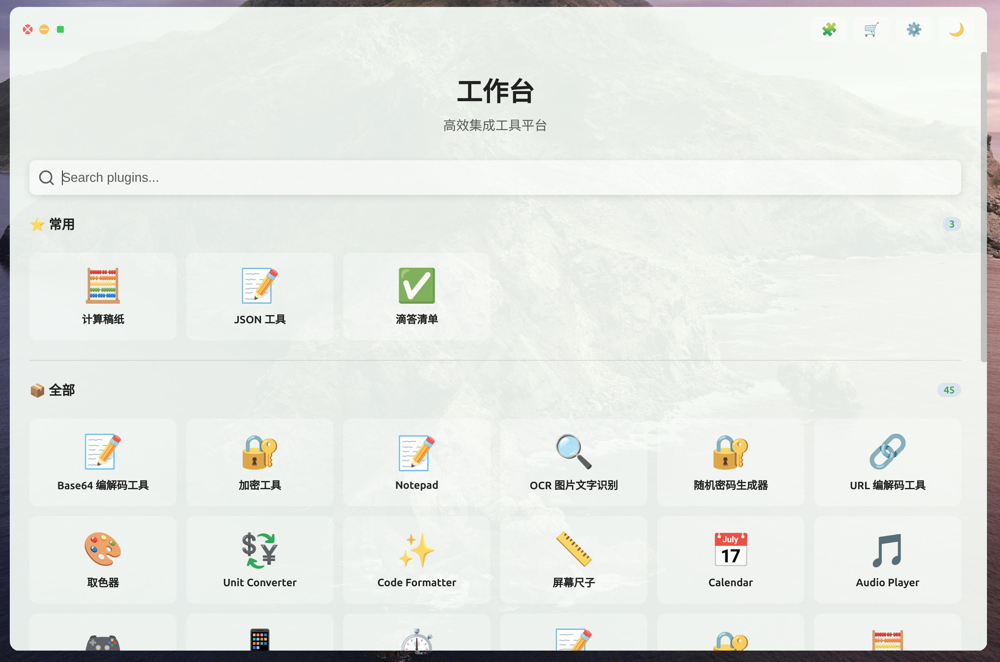
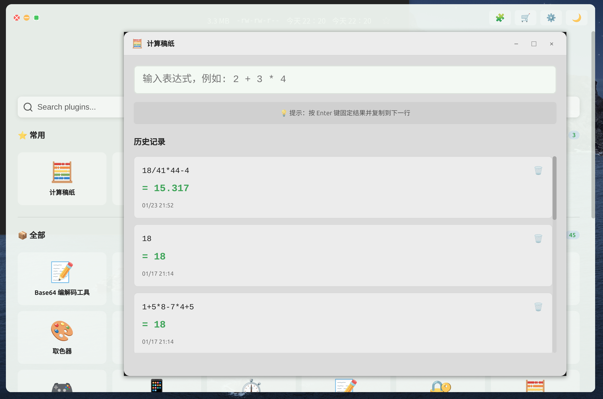
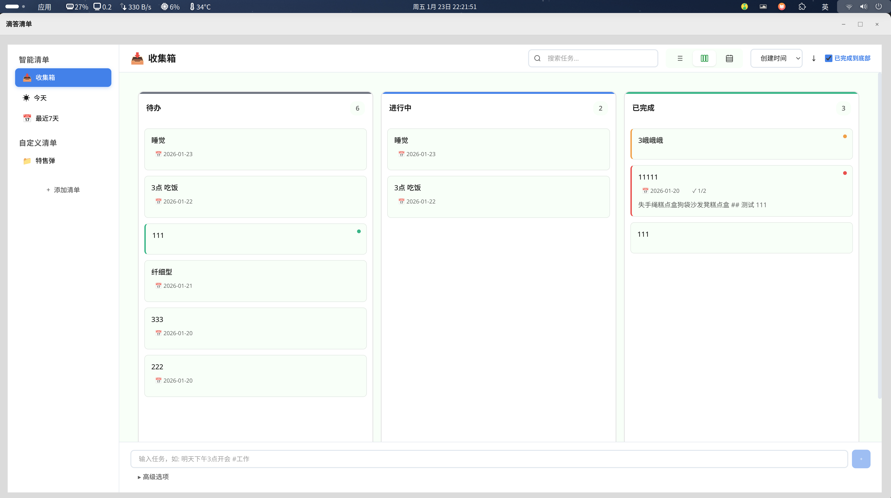
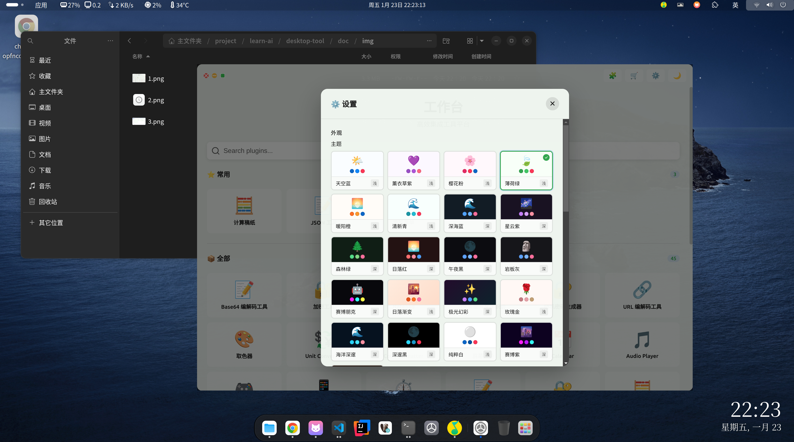

# Desktop Tool

> 类似 uTools 的跨平台桌面工具平台






## 快速开始

### 环境要求

- Node.js >= 18.0.0
- npm / yarn / pnpm

### 安装运行

```bash
# 安装依赖
npm install

# 开发模式
npm run dev

# 构建应用
npm run dist
```

## 核心功能

- **插件系统** - 可扩展架构，独立窗口
- **数据备份** - 全量/选择性备份
- **性能监控** - 实时性能面板
- **事件总线** - 组件间通信

## 技术栈

- Electron + React + TypeScript
- Vite + Vitest
- SQLite 数据库

## 文档

- **详细文档**: [doc/README.md](doc/README.md)
- **AI 开发**: [CLAUDE.md](CLAUDE.md)

## 开发

```bash
npm run dev              # 开发模式
npm test                 # 运行测试
npm run type-check       # 类型检查
npm run lint             # 代码检查
```

## 许可证

MIT
